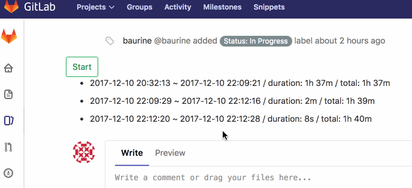
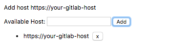

# Gitlab Issue Time Tracker Chrome Extension

A chrome extension to help track gitlab issue time.

Config your personal gitlab host at first:

[Install from chrome store](https://chrome.google.com/webstore/detail/time-tracker-for-gitlab-i/oopjgpigefbdgfenihhkfggfjmooloia)

## TODO

- [x] Add "Start / Stop" button in gitlab issue page
- [x] Save data in chrome storage
- [x] Make host configurable
- [x] Publish to chrome store
